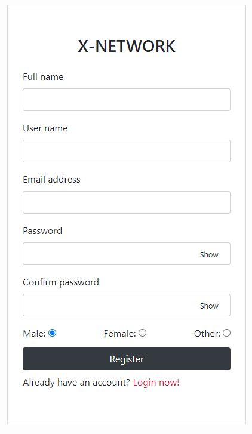

# Social network - X-Network

[You can see screenshots of the messenger below](#screenshots)

## Install

1. `npm install` или `yarn install`
2. Delete `example.env` file at `server/`.
3. Create `.env` file at `server/` and enter your values in it. More on this below.

   ```
   PORT=
   NODE_ENV=development
   MONGODB_URI=

   ACCESS_TOKEN_SECRET=
   REFRESH_TOKEN_SECRET=
   ```

4. Install MongoDB and start it.
5. Run command
   - Client
     - `npm start` or `yarn start`
   - Server
     - `npm dev` or `yarn dev`

## <a name="screenshots">Demo</a>

<div align="center" >
  <h3>Login</h3>
  
 
  <h3>Register</h3>
  
  
  <h3>Home</h3>
  

  <h3>Notify</h3>
  

  <h3>Own profile</h3>
  

  <h3>Own profile / edit</h3>
  

  <h3>Own profile / followers</h3>
  

  <h3>Follower profile</h3>
  

  <h3>Chat</h3>
  

  <h3>Call audio</h3>
  

  <h3>Call video</h3>
  

  <h3>Stream video</h3>
  
</div>
